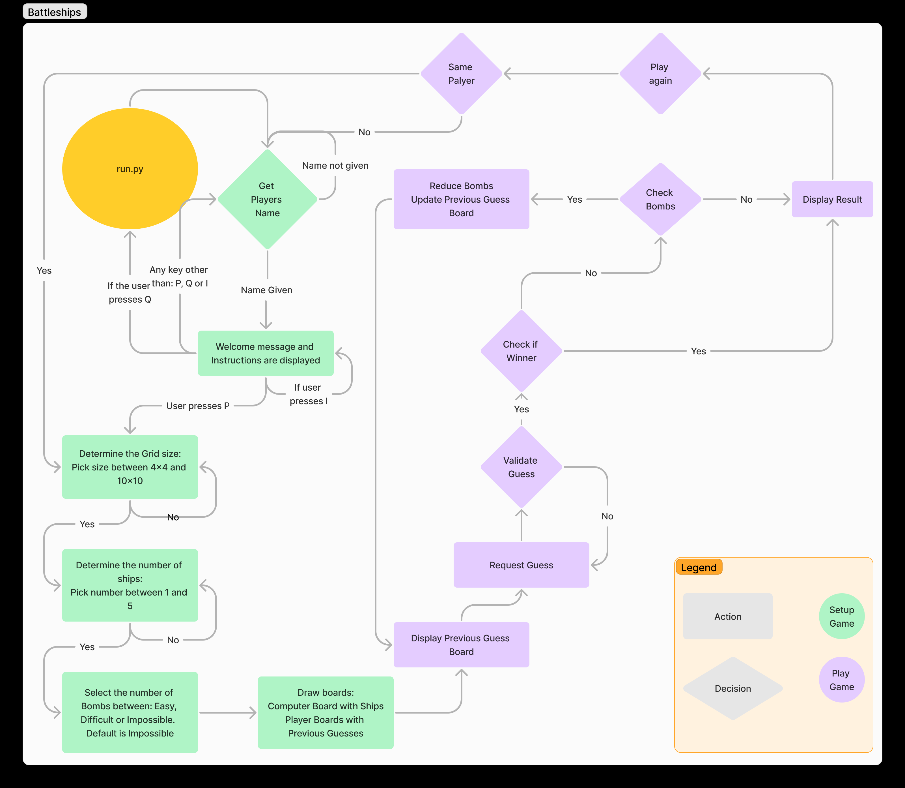

# Table of contents

- [Table of contents](#table-of-contents)
- [Battleships](#battleships)
  - [Site Owner Goals](#site-owner-goals)
  - [Design](#design)
  - [Constraints](#constraints)
  - [Testing](#testing)
  - [Technologies Used](#technologies-used)
  - [Deployment](#deployment)
  - [Credits](#credits)
  - [Acknowledgments](#acknowledgments)

# Table of contents

# Battleships

This game is designed to allow you to select the grid size you want to play in, the number of ships you want the computer to place in the grid and determine the number of bombs you want to be able to use.  The grid size is a square and can be between 4x4 and 10x10 in size.  After each guess, the board with results of your previous guesses will be displayed and the number of bombs you have remaining.  At the end of the game you will be asked if you want to play again or return to the main menu.
This welcome message and instructions will appear whenever the game starts or restarts with a new player, it explains how the game works.
    * denotes a HIT
    X denotes a MISS from a previous guess
    | | denotes a potential space for a guess.
The Welcome and Instructions will disappear after 15 seconds.
The game is designed to clear/cls the screen at appropriate stages using Python SLEEP and CLEAR commands.

## Site Owner Goals
- To provide the user with an easy to navigate game that is fun to play against a computer.
- To present the user with a game that is visually appealing and fully responsive.
- To present the user with an application that is intuitive and does not need any instructions, despite them being provided.  

###	First Time User
- The application user wants to play a logic game.
- As a first time user I want to be able to easily understand the purpose of the game.
- As a first time user I want to be able to intuitively navigate the game, play the game, see my result and restart the game once it ends.
- As a first time user I want to be able to access the instructions of the game.

### Returning user
- As a returning user I want to have fun.
- As a returning user I want to increase the level of difficulty from Easy to Difficult and possibly even Impossible.
- As a returning user I want to beat the computer.

## Design
Battleships follows this flowchart:

On initialisation, the player is asked for their name, the size of the grid they want to play on, the number of ships they want to pursue and the number of bombs they want to have available to them.
1. grid_size is requested and has error checking so that the user can only progress by picking a number between 4 and 10.  Once they pick that number, a square grid with that number of squares will be displayed.
1. The number of ships are then requested and have error checking to ensure that the user picks a number between 1 and 5
1. Finally, the number of bombs are requested.  The user can choose Easy, Difficult or Impossible.  The number of bombs is determined by the grid_size and the difficulty level.
1. Once the name, grid_size, ships and bombs are determined, two boards are drawn.  Both boards will be grid_size x grid_size in height and width.  The appropriate letters will be displayed as a header to give the columns in the grid unique letters for the user to identify their chosen column.  A row number for each row in the height of the grid is displayed to identify the row number for the users guess.  The row numbers begin at 0.  
1. The COMPUTER_BOARD is created and randomly populated with the chosen number of ships.  The PREVIOUS_GUESS_BOARD is displayed empty, then the game begins.  The user is requested to choose a letter from those displayed above the columns.  Error checking validates that its an appropriate letter.  If not, the user is requested for the information again.
1. The user is then prompted for a row number.  Again, error checking ensures that only a row number within the grid_size is chosen.
1. Once a valid guess is entered, the application checks to see if this guess was previously chosen, represents a Hit or a Miss.
1. A previously chosen guess or a previously chosen Hit, gives a message that that was already chosen/Hit, the user is asked to guess again, but the number of bombs does not reduce.
1. If the users guess is a Hit, then a * is placed in the PREVIOUS_GUESS_BOARD, the number of bombs is reduced by 1 and the updated PREVIOUS_GUESS_BOARD is displayed with the * in the location that the user chose.
1. If the users guess is a Miss, then an X is placed in the PREVIOUS_GUESS_BOARD, the number of bombs is reduced by 1 and the updated PREVIOUS_GUESS_BOARD is displayed with the X in the location that the user chose.
1. The game continues until one of the following conditions is met:
- The user has hit all of the ships
- The user has run out of bombs
12. Once the game status is determined, the user is asked if they want to play again.  If so, they are prompted for grid_size, ships and bombs but not their name as that's unlikely to have changed since they started the game :)
1. If the user decides to not play again, the game restarts and requests the next user for their name, grid_size, ships and bombs.

### Colours
Color is limited to Black and White due to the use of a terminal screen as opposed to a html canvas

### Imagery
There is no imagery in the application.  

### Workflow
The workflow was produced using [figma.com](https://www.figma.com/). 

## Constraints
The deployment terminal is set to 79 columns by 24 rows. 

## Testing

## Input testing
For each input, the following test scenarios were performed:
- input a letter when a number is requested
  - the user is advised of their error and asked for the input again
- input a number when a letter is requested
  - the user is advised of their error and asked for the input again
- press enter without any input
  - either a default value is chosen, or
  - the user is advised of their error and asked for the input again
- input a letter/number outside the range allowed
  - the user is advised of their error and asked for the input again

    
### Device Testing
The application was viewed on a variety of devices such as Desktop, Laptop, iPhone 8, iPhone 11, iPad, and Androids.  The application performed as expected.  However on mobile devices Heroku is practically unnavigable as it provides no scroll bars when the entire screen is not visible.  

### Friends and Family User Testing
Friends and family members were asked to review the application and documentation to point out any bugs and/or user experience issues.  Most found the game quite annoying due to the command line interface being required.  However, no bugs were reported.  Feedback was to increase the duration of the WELCOME message and to reduce the duration that the GET_RESULTS is displayed

### Fixed Bugs

#### os.system('clear')
Using the os command os.system('clear') causes an error on Windows but does work on Linux.  I updated the CLEAR function to check which OS the program was running on and use the OS appropriate clear/cls option.  

### Testing
I have tested the following scenarios:
- grid_size only works between 4 and 10 inclusive using try/except
- ships only works between 1 and 5 inclusive using try/except
- guess letter only works within the range of the displayed grid
- guess number only works within the range of the displayed grid
- bombs only works by entering E or D or I, all other inputs result in the default value of IMPOSSIBLE.
- Play Again has worked with all of the possible scenarios such as doing it at the begining of the game, doing at the end of a game or changing player and then continuing.

### Known Bugs
1. In Heroku, some paragraphs do not go onto a new line despite previous lines in the same paragraph, written with the same commands wrapping correctly.
1. On android phones, when you enter a choice on Heroku, the residue of previous choices appears before you press ENTER.

This example shows where I entered my name on the previous screen: "declan" and then chose option "c" on this screen.  Instead of showing "c", it shows "declanc".  However, it does not prevent the game from progressing with option "c".

### Features Left to Implement
- Allow users to login and create a profile so that their scores could be recorded on a persistent leaderboard.  
- Save player score to the leaderboard.  
- slider in the HTML header to change the grid_size, number of bombs and number of ships

## Technologies Used

### Languages
- Python

### Frameworks - Libraries - Programs Used
- [GitHub](https://github.com/) - Used for version control and hosting.
- [MyGitHub](https://github.com/DMASCoreDeclan/tic-tac-toe-js) - Used for version control and hosting of this project.
- [Heroku](https://heroku.com/) - Used for python hosting.
- [Pep8 Validator](https://pep8ci.herokuapp.com/)
- [Code Beautify](https://codebeautify.org/python-formatter-beautifier?utm_content=cmp-true)
- [TOC Generator](https://luciopaiva.com/markdown-toc/)

## Deployment

The project was deployed using Heroku. 
The code can be found here - [Battleships](https://github.com/DMASCoreDeclan/battleship.git)
The live link can be found here - [Battleships](https://battleships-declan-cc9af76960c2.herokuapp.com/)

### Resources Used

 While all of the code used in this file has been typed by the author, the final design is influenced from a design perspective by: 
 [Knowledge Maven](https://www.youtube.com/watch?v=tF1WRCrd_HQ)

The Battleships logo came from: 
[Battleships logo](https://www.battleshipcycles.com/images/battleshipcycles-logo.png)

### Technologies Used
1. `heroku/python`
2. `heroku/nodejs`
1. Python OS / Time / Randint
 
 

## Acknowledgments
My mentor Antonio for his support and advice and to Jamie, cohort lead in Code Institute

The Code Institute slack community for their quick responses and very helpful feedback!